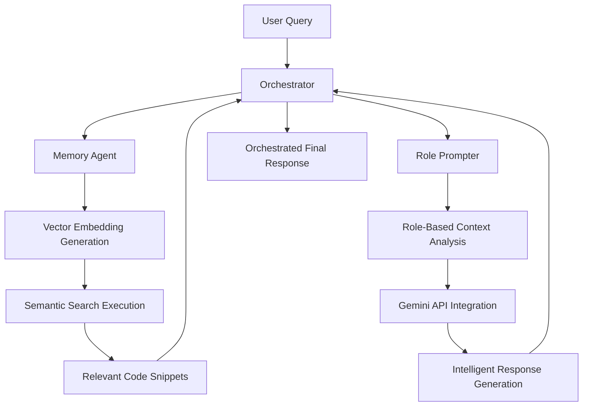

# CODELENS - Multi-Agent Intelligence & Visualization AI System

[](https://www.python.org/downloads/)
[](https://fastapi.tiangolo.com/)
[](https://react.dev/)
[](https://www.mongodb.com/)
[](https://ai.google.dev/)

CODELENS is an intelligent multi-agent code understanding system that combines hybrid retrieval, role-aware answering, and query-driven graph visualization to help teams reason about large codebases faster and with higher confidence.

## Key Highlights

- Multi-agent orchestration for retrieval, explanation, visual mapping, and session memory.
- Hybrid retrieval (vector + lexical + graph expansion) for high relevance.
- Query-focused graph visualization for every answer (nodes + edges + evidence context).
- Fast and cost-efficient workflow via incremental indexing and pluggable model providers.
- Time-efficient developer experience for debugging, onboarding, and architecture discovery.

## Problem Statement

Engineering teams lose time when code understanding is fragmented across many files and modules:

1. Search returns text matches, not reasoning paths.
2. Cross-file dependencies are difficult to trace quickly.
3. Onboarding and debugging cycles become expensive.
4. Teams repeatedly spend time rediscovering known architecture patterns.

## Proposed Solution

CODELENS creates an AI-native code intelligence layer over repositories:

1. Indexes source code into files, symbols, chunks, embeddings, and edges.
2. Uses hybrid retrieval to fetch the most relevant context.
3. Produces grounded answers with citations and confidence signals.
4. Returns a per-query graph so users can see why an answer is correct.

## Why Multi-Agent

The platform separates responsibilities into cooperating agents:

1. Orchestrator Agent: routes query workflow.
2. Retrieval Agent: finds relevant context using hybrid search.
3. Explanation Agent: composes grounded answer from retrieved evidence.
4. Visual Mapper Agent: builds graph payload for interactive understanding.
5. Session Memory Agent: maintains short-term conversation context.

This architecture improves modularity, debugging visibility, and future scalability.

## Agentic Workflow Demonstration


## VS Code Extension Usage

CODELENS is also designed to be used as a VS Code extension-style developer companion, so teams can ask codebase questions and explore architecture without leaving the editor.

### Why this matters

1. In-editor intelligence: developers get query answers, citations, and graph context directly where they code.
2. Faster debugging: jump from answer to related file/symbol flow in fewer steps.
3. Better onboarding: new engineers can understand system structure from visual query graphs.
4. Cost efficiency: focused retrieval reduces broad, expensive model calls.
5. Time efficiency: fewer context switches between IDE, docs, and external tools.
6. Team consistency: role-aware guidance gives standardized, explainable responses across contributors.

### High-impact extension scenarios

1. "Where is this API actually used?" -> immediate symbol/file flow and edge context.
2. "What changed impact for this function?" -> cross-file relations and focused graph reasoning.
3. "How does auth/retrieval/orchestration work?" -> query-level visual map with grounded evidence.

### Extension Roadmap

Planned VS Code extension capabilities:

1. Planned commands
- `CODELENS: Ask About Selection`
- `CODELENS: Build Focused Graph`
- `CODELENS: Reindex Current Workspace`

2. Planned sidebar views
- Query History and Saved Insights
- Graph Explorer (focused/full modes)
- Evidence Panel (citations, confidence, edge context)

3. Planned inline CodeLens actions
- `Explain this symbol`
- `Find callers and dependencies`
- `Show impact graph`

## Query-Level Visualization Impact

For each query, visualization improves decision quality:

1. Makes inter-file and inter-symbol relations visible.
2. Shows focused context instead of overwhelming full-repo noise.
3. Improves trust by linking answers to concrete graph evidence.
4. Reduces time to root cause during debugging.
5. Speeds architecture comprehension for new team members.

## Repository Structure

- `agentic_backend/`: primary multi-agent backend (FastAPI + indexing + retrieval + graph API).
- `frontend/`: React/Vite UI for query and graph exploration.
- `src/`: legacy/parallel pipeline components.
- `infra/mongodb/`: Mongo schema and Atlas search index assets.
- `docs/`: setup and integration notes.

## Core Features and Workflow

1. Repository indexing
- Full and incremental indexing pipelines.
- Symbol-aware chunking and embedding generation.

2. Intelligent Q&A
- `/ask` endpoint orchestrates retrieval + explanation.
- Returns answer, confidence, citations, and graph payload.

3. Graph exploration
- `/graph/overview` supports full and focused graph modes.
- `/graph/node/{node_id}` and `/graph/edge-context` provide deep drill-down.

## Tech Stack

Backend:

- Python 3.11+
- FastAPI + Uvicorn
- Pydantic
- MongoDB / MongoDB Atlas

AI and retrieval:

- Gemini integration for answer generation
- Hybrid retrieval (vector + lexical + graph)
- Pluggable embedding providers

Frontend:

- React + TypeScript
- Vite
- XYFlow + Dagre (graph rendering/layout)

Quality:

- Pytest
- Mongomock
- ESLint + TypeScript tooling

## Quick Start (Current Repo)

### Prerequisites

1. Python 3.11+
2. Node.js 18+
3. MongoDB Atlas URI (or local MongoDB)

### Setup

```bash
python -m venv venv
# Windows
.\venv\Scripts\activate

pip install -r requirements.txt
pip install -r agentic_backend\requirements.txt
```

Create root `.env` from `.env.example` and update required values such as:

```env
MONGODB_URI=<your-uri>
MONGODB_DB=hackbite2
EMBEDDING_PROVIDER=local
EMBEDDING_MODEL=hash-v1
EMBEDDING_DIM=1536
```

### Run Backend

```bash
.\run_api.ps1
```

Backend default URL: `http://localhost:8081`

### Run Frontend

```bash
cd frontend
pnpm install
pnpm dev
```

Frontend default URL: `http://localhost:5173`

## API Highlights

- `GET /health`
- `GET /repos`
- `POST /index/full`
- `POST /index/incremental`
- `POST /retrieve/query`
- `POST /ask`
- `GET /graph/overview`
- `GET /graph/node/{node_id}`
- `GET /graph/edge-context`

## Performance, Cost, and Time Efficiency

Performance:

- Focused retrieval and graph caps keep response flow fast.
- Incremental indexing avoids unnecessary full recomputation.

Cost efficiency:

- Pluggable providers allow budget-aware model selection.
- Evidence-first retrieval reduces token-heavy blind generation.

Time efficiency:

- Faster root-cause analysis and code navigation.
- Lower onboarding time through graph-first architecture visibility.

## Business Model and Future Scope

Potential directions:

1. SaaS offering for engineering teams (seat + usage tiers).
2. Enterprise private deployment with compliance controls.
3. API/SDK integration with IDE and DevOps workflows.
4. Advanced modules: architecture drift alerts, impact analysis, and automated documentation.

Near-term roadmap:

1. Richer inter-file relation extraction across more languages.
2. Multi-hop graph reasoning with controllable depth.
3. Enhanced query-level graph explainability and ranking diagnostics.

## Submission Checklist

- [ ] All code in `src/` and `agentic_backend/` runs without errors
- [ ] `ARCHITECTURE.md` has final architecture narrative and diagram
- [ ] `EXPLANATION.md` includes planning, memory/tool use, and limitations
- [ ] `DEMO.md` links a 3-5 minute demo with timestamped highlights

---

Built for rapid, explainable, multi-agent code intelligence with measurable impact on developer speed, cost, and confidence.
